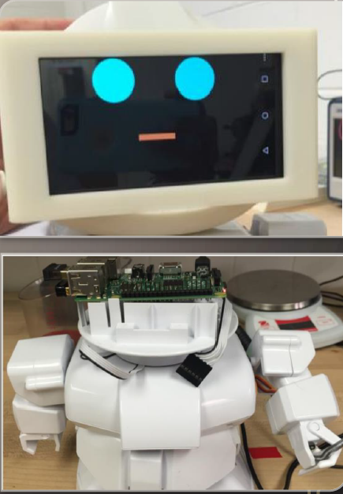
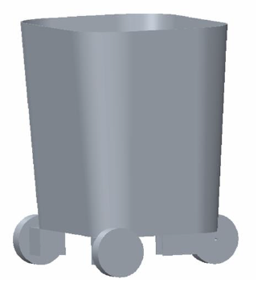

[{ABOUT ME}](https://kfrancis01.github.io/Portfolio_KeaFrancis.github.io/About) / 
[{CONTACT}](https://kfrancis01.github.io/Portfolio_KeaFrancis.github.io/Contact) / 
[{COLLABORATE}](keamfrancis96@gmail.com) / 
[{BLOG}]() / 

## Kea's Robotics/Engineering Portfolio ##

<p> Hello there! <p>
<p> I am a Junior Robotics Engineer attempting to change the world for the better with robotics. 
I love working on both group and individual robotics projects. This portfolio is a summary of some of the projects I have worked on in the past. 
Just click on the picture and you will be provided with a project description along with a link to the GitHub repository it is associated with. <p>


<h3>Projects:</h3> 
<br/>
<h4>* Autonomous TrashCan (In Progress)</h4> <br />
<p><a href="https://kfrancis01.github.io/Portfolio_KeaFrancis.github.io/Autonomous_TrashCan">{Project Page}</a></p>
<br/>

<h4> * CleanRobotics TrashBot (Former Robotics Engineer) </h4><br/>
<p><a href="https://kfrancis01.github.io/Portfolio_KeaFrancis.github.io/CleanRobotics">{Project Page}</a></p>
<br/>

<h4> * Autonomous Lawnmower (Completed) </h4> <br/>
<p><a href="https://kfrancis01.github.io/Portfolio_KeaFrancis.github.io/Lawn Mower">{Project Page}</a></p>
[{Project Page}]() <br/>

<h4> * RAPIRO: Autonomous Teaching Robot (Completed) </h4><br/>
<p><a href="https://kfrancis01.github.io/Portfolio_KeaFrancis.github.io/RAPIRO">{Project Page}</a></p>
<p></p>

<h4> * Mechatronic Final Project (Completed) </h4><br/>
<p><a href="https://kfrancis01.github.io/Portfolio_KeaFrancis.github.io/Mech">{Project Page}</a></p>
<p></p>

<h4> * Dal-Tile Robot Area Computerized Maintenance Management System and Parts List (Former Employee | Completed-ish) </h4><br/>
<p><a href="https://kfrancis01.github.io/Portfolio_KeaFrancis.github.io/CMMS">{Project Page}</a></p>
<p></p>

<h4> * NASA Ice Challenge Robot (Completed) </h4><br/>
<p><a href="https://kfrancis01.github.io/Portfolio_KeaFrancis.github.io/NASA">{Project Page}</a></p>
[{Project Page}]() <br/>

<h4> * MRI Compatible Robot (Completed </h4><br/>
<p><a href="https://kfrancis01.github.io/Portfolio_KeaFrancis.github.io/MRI">{Project Page}</a></p>


```
For more details see [GitHub Flavored Markdown](https://guides.github.com/features/mastering-markdown/).

### Support or Contact
Having trouble with Pages? Check out our [documentation](https://docs.github.com/categories/github-pages-basics/) or [contact support](https://support.github.com/contact) and we’ll help you sort it out.
